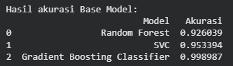
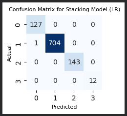

# Laporan Proyek Machine Learning - Aprizal
## Domain Proyek
#### Latar Belakang
Provinsi Riau merupakan salah satu wilayah di Indonesia yang memiliki kerentanan tinggi terhadap bencana kebakaran hutan dan lahan (Karhutla), terutama karena luasnya area lahan gambut di wilayah tersebut. Kebakaran hutan tidak hanya berdampak pada kerusakan ekosistem dan hilangnya biodiversitas, tetapi juga menimbulkan kabut asap yang membahayakan kesehatan masyarakat, mengganggu transportasi, dan menyebabkan kerugian ekonomi yang masif hingga ke negara tetangga.
Faktor meteorologis memegang peranan krusial dalam memicu dan memperparah kondisi kebakaran. Variabel seperti suhu udara yang tinggi, kelembapan yang rendah, curah hujan yang minim, serta kecepatan angin, secara langsung mempengaruhi tingkat kekeringan bahan bakar (vegetasi) di hutan.
Masalah utama saat ini adalah seringnya penanganan dilakukan setelah api membesar (reaktif). Oleh karena itu, diperlukan pendekatan preventif melalui sistem peringatan dini (early warning system). Dengan memanfaatkan data historis cuaca dari Badan Meteorologi, Klimatologi, dan Geofisika (BMKG), teknologi Machine Learning dapat diterapkan untuk memprediksi tingkat risiko kebakaran. Solusi ini diharapkan dapat membantu pemangku kepentingan untuk melakukan mitigasi lebih awal sebelum titik api (hotspot) muncul atau meluas.
Referensi Terkait: 
- [Latif](https://www.researchgate.net/publication/256547041_Correlation_between_Hotspots_and_Air_Quality_in_Pekanbaru_Riau_Indonesia_in_2006-2007) et al. (2010). "Correlation_between_Hotspots_and_Air_Quality_in_Pekanbaru_Riau_Indonesia_in_2006-2007" Jurnal Meteorologi dan Geofisika. Studi ini menunjukkan korelasi kuat antara penurunan curah hujan dan kelembapan relatif dengan peningkatan jumlah titik panas di lahan gambut Riau.
- [Syaufina](https://scholar.google.com/citations?view_op=view_citation&hl=en&user=ORfLDyoAAAAJ&citation_for_view=ORfLDyoAAAAJ:J-pR_7NvFogC), L. (2008). "Kebakaran hutan dan lahan di Indonesia: perilaku api, dan dampak kebakaran" Buku ini menjelaskan bahwa parameter cuaca adalah indikator utama dalam Fire Danger Rating System (FDRS)
## Business Understanding
### Problem Statements
Berdasarkan latar belakang di atas, berikut adalah perincian masalah yang akan diselesaikan:
- Bagaimana cara mengolah data parameter cuaca (Suhu, Kelembapan, Curah Hujan, Angin, Temperatur) untuk mendeteksi pola risiko kebakaran?
- Bagaimana membangun model machine learning yang mampu mengklasifikasikan tingkat risiko kebakaran (Low, Moderate, High, Very High) dengan akurasi yang tinggi?
- Bagaimana meningkatkan performa model prediksi agar lebih stabil dan akurat dibandingkan menggunakan satu algoritma tunggal?
### Goals
Tujuan dari proyek ini adalah:
- Melakukan analisis data eksploratif untuk memahami hubungan antara fitur cuaca dengan label risiko kebakaran.
- Membangun model klasifikasi yang dapat memprediksi 4 kelas risiko kebakaran (0 : Low, 1 : Moderate, 2 : High, 3 : Very High).
- Meningkatkan akurasi dan stabilitas prediksi menggunakan teknik ensemble (Stacking) dan hyperparameter tuning, dengan target metrik evaluasi (F1-Score/Accuracy) di atas 85%.
### Solution Statements
Untuk mencapai tujuan tersebut, solusi yang diajukan adalah sebagai berikut:
##### 1. Penggunaan Multiple Algorithms & Benchmarking:
 Mengembangkan beberapa model dasar (base models) dengan karakteristik berbeda untuk melihat algoritma mana yang paling cocok dengan pola data. Algoritma yang akan digunakan meliputi:
  - Random Forest Classifier: Algoritma berbasis bagging yang kuat terhadap overfitting dan baik dalam menangani data non-linear.
  - Gradient Boosting Classifier: Algoritma berbasis boosting yang sangat efisien dan sering memberikan performa terbaik pada data tabular.
  - Support Vector Machine (SVM): Efektif untuk ruang dimensi tinggi.
##### 2. Penerapan Stacking Ensemble & Hyperparameter Tuning:
Melakukan improvement terhadap model melalui metode Stacking.
  - Strategi: Menggabungkan prediksi dari model-model dasar (Random Forest, Gradient Boosting, SVM) sebagai input baru untuk meta-learner (Logistic Regression) guna menghasilkan prediksi akhir yang lebih akurat dan mengurangi bias.
  - Hyperparameter Tuning: Menggunakan GridSearchCV untuk mencari parameter optimal pada model terbaik guna memaksimalkan metrik evaluasi.
### Data Understanding
Data yang digunakan dalam proyek ini bersumber dari stasiun pemantauan BMKG Provinsi Riau. Dataset ini mencakup rekaman harian parameter cuaca yang telah diberi label tingkat risiko kebakaran berdasarkan analisis historis kejadian kebakaran.
- Sumber Data: Data internal/publikasi BMKG Provinsi Riau (Tautan: [Dataset BMKG Drive](https://drive.google.com/drive/folders/1wb-62EanBHuhaWhVZdj8y9SfXrgDV2Wf). 
- Jumlah Data: Dataset terdiri dari 4930 baris (records) dan 14 kolom.
- Format: CSV / Excel.
##### Variabel atau Fitur
Berikut adalah uraian variabel dalam dataset:
- Tanggal: Tanggal pencatatan data cuaca (Tipe data: Object). Fitur ini memberikan informasi temporal yang dapat digunakan untuk analisis time-series atau melihat tren musiman.
- Tn (Temperatur minimum): Suhu udara terendah yang tercatat dalam satu hari dalam satuan derajat Celcius (°C).
- Tx (Temperatur maksimum): Suhu udara tertinggi yang tercatat dalam satu hari dalam satuan derajat Celcius (°C). Suhu maksimum yang ekstrem dapat menjadi indikator kuat potensi kekeringan.
- Tavg (Temperatur Rata-rata): Suhu udara harian rata-rata dalam satuan derajat Celcius (°C). Suhu tinggi meningkatkan penguapan air dari tanah dan vegetasi.
- RH_avg (Kelembapan Rata-rata): Persentase uap air di udara (%). Kelembapan rendah membuat bahan bakar (daun kering/ranting) lebih mudah terbakar.
- RR (Curah Hujan): Jumlah air hujan yang turun dalam milimeter (mm). Curah hujan adalah faktor pembasah utama.
- ss (Lamanya penyinaran matahari): Durasi penyinaran matahari dalam satuan jam. Semakin lama penyinaran, semakin tinggi potensi penguapan dan pengeringan lahan.
- ff_x (Kecepatan angin maksimum): Kecepatan angin tertinggi yang tercatat dalam satu hari (m/s). Angin kencang dapat memicu penyebaran api yang cepat.
- ddd_x (Arah angin saat kecepatan maksimum): Arah dari mana angin bertiup saat kecepatan maksimum terjadi, dinyatakan dalam derajat (°) arah mata angin.
- ff_avg (Kecepatan Angin Rata-rata): Kecepatan pergerakan udara dalam meter per detik (m/s). Angin mempercepat penyebaran api dan pengeringan lahan.
- ddd_car (Arah angin terbanyak): Arah angin yang paling dominan bertiup sepanjang hari tersebut (°) (Tipe data: Object/String).
- Kelembaban Permukaan Tanah: Tingkat kadar air pada lapisan atas tanah. Sangat krusial di lahan gambut Riau.
- Tingkat Resiko Kebakaran: Label deskriptif mengenai kategori risiko kebakaran (Tipe data: Object), misalnya "Low", "Moderate", “High”, “Very High”.
- Fire_Risk_Label (Target): Kategori tingkat risiko kebakaran.
0: Low (Rendah)
1: Moderate (Sedang)
2: High (Tinggi)
3: Very High (Sangat Tinggi/Ekstrem)
##### Tahapan Pemahaman Data (EDA)
Untuk memahami data, langkah-langkah berikut dilakukan:
- Informasi Data: Melihat fitur-fitur yang tersedia di dalam data, type data dan panjang baris dari datasetnya.
- Deskripsi Statistik: Melihat mean, median, min, max, dan standar deviasi untuk mendeteksi anomali.
- Missing Values: Melihat apakah terdapat nilai yang hilang(NaN) dalam dataset tersebut.
- Data Duplikat: Mengecek apakah terdapat data duplikat pada dataset, ini akan berpengaruh besar jika masih ada duplikat di dalam dataset
- Univariate Analysis: Visualisasi distribusi tiap fitur menggunakan Histogram dan Boxplot untuk mendeteksi outliers.
- Multivariate Analysis: Menggunakan Correlation Matrix (Heatmap) untuk melihat hubungan antar fitur cuaca dan hubungan fitur terhadap target. Ini membantu mengidentifikasi fitur yang paling berpengaruh (misalnya, korelasi negatif kuat antara Curah Hujan dan Risiko Kebakaran).
- Target Balance Check: Memeriksa proporsi jumlah data antar kelas (0, 1, 2, 3) untuk melihat apakah terjadi imbalance data.
### Data Preparation
Tahapan data preparation sangat krusial untuk memastikan data siap dilatih oleh model. Proses yang dilakukan secara berurutan adalah:
1. Data Cleaning (Pembersihan Data)
    - Penanganan Missing Values: Melakukan pengecekan nilai NaN. Jika terdapat data kosong pada fitur numerik (seperti Tavg atau RR), akan diisi dengan nilai rata-rata (mean) atau median, atau menghapus baris jika persentasenya sangat kecil.
    - Alasan: Algoritma machine learning umumnya tidak dapat memproses input yang memiliki nilai kosong.
2. Handling Outliers
    - Metode: Menggunakan metode IQR (Inter Quartile Range) untuk mendeteksi nilai ekstrem pada fitur curah hujan atau kecepatan angin yang mungkin merupakan kesalahan pencatatan alat.
    - Alasan: Outlier dapat mendistorsi model statistik dan mengurangi akurasi, terutama pada model yang sensitif terhadap jarak seperti SVM.
3. Data Splitting (Pembagian Data)
    - Proses: Membagi dataset menjadi Train Set (80%) dan Test Set (20%).
    - Alasan: Diperlukan untuk mengevaluasi performa model pada data yang belum pernah dilihat sebelumnya (unseen data) guna menghindari overfitting.
4. Feature Scaling (Standarisasi)
    - Metode: Menggunakan StandardScaler atau MinMaxScaler untuk mengubah skala data fitur numerik agar memiliki rentang yang seragam.
    - Alasan: Fitur seperti Curah Hujan (0-100mm) dan Temperatur (20-35°C) memiliki skala berbeda. Algoritma seperti SVM dan Neural Networks sangat sensitif terhadap skala data. Penyetaraan skala mempercepat konvergensi gradien.
5. Handling Imbalanced Data 
    - Metode: Jika analisis EDA menunjukkan ketimpangan kelas yang ekstrem, teknik SMOTE (Synthetic Minority Over-sampling Technique) diterapkan pada data latih.
    - Alasan: Agar model tidak bias memprediksi kelas mayoritas (misal: selalu memprediksi "Low") dan mengabaikan kelas minoritas ("Very High").
### Modeling
Pada tahap ini, model machine learning dibangun untuk menyelesaikan permasalahan klasifikasi risiko kebakaran.
##### Pendekatan: Stacking Ensemble
Sesuai dengan Solution Statement, strategi utama adalah menggunakan metode Stacking.
##### Tahap 1: Base Models (Level-0)
Tiga algoritma digunakan sebagai fondasi:
1. Random Forest Classifier
    - Parameter: n_estimators , max_depth, min_samples_split, criterion, max_features
    - Kelebihan: Robust terhadap noise, mampu menangani hubungan non-linear, tidak terlalu butuh scaling.
    - Kekurangan: Kompleksitas tinggi, waktu training bisa lama jika pohon sangat banyak.
2. Gradient Boosting Classifier
    - Parameter: learning_rate, n_estimators, max_depth
    - Kelebihan: Performa prediksi sangat tinggi, memiliki regularisasi bawaan untuk mencegah overfitting.
    - Kekurangan: Banyak hyperparameter yang harus dituning, sensitif terhadap outlier.
3. Support Vector Machine (SVM)
    - Parameter: C (regularisasi), kernel (RBF/Linear), gamma.
    - Kelebihan: Efektif pada ruang dimensi tinggi, akurat jika margin antar kelas jelas.
    - Kekurangan: Berat secara komputasi pada dataset besar, sensitif terhadap noise.
##### Tahap 2: Meta Model (Level-1)
- Algoritma: Logistic Regression.
- Fungsi: Model ini akan belajar dari prediksi (probabilitas) yang dihasilkan oleh ketiga Base Models di atas untuk membuat keputusan final.
- Alasan Memilih Stacking: Stacking seringkali memberikan performa yang lebih baik daripada model tunggal karena ia menggabungkan kekuatan masing-masing model ("Wisdom of the Crowd"). Random Forest menutupi varians, SVM menangani margin, dan Gradient Boosting Classifier menangani bias.
##### Improvement dengan Hyperparameter Tuning
Sebelum melakukan stacking, setiap base model dioptimalkan menggunakan GridSearchCV.
- Proses ini menguji kombinasi parameter (misalnya mencoba n_estimators [100, 200, 300] pada Random Forest) dan memilih kombinasi yang menghasilkan skor validasi silang (cross-validation) terbaik.
- Model dengan parameter terbaik (best_params_) kemudian digunakan dalam arsitektur Stacking.
### Evaluation
Tahap evaluasi bertujuan untuk mengukur seberapa baik model bekerja dalam memprediksi risiko kebakaran hutan.
##### Metrik Evaluasi
Mengingat ini adalah masalah klasifikasi multi-kelas, metrik yang digunakan adalah:
- Accuracy:
   - Deskripsi: Rasio prediksi benar terhadap total data.
   - Penggunaan: Memberikan gambaran umum kinerja model.
   - Hasil dalam proyek: Model Stacking berhasil mencapai Akurasi  0.998987
- Precision:
   - Deskripsi: Seberapa akurat model saat memprediksi risiko "High" (Berapa banyak yang benar-benar "High" dari semua yang ditebak "High").
   - Relevansi: Penting untuk meminimalkan False Positive (Alarm palsu) agar sumber daya pemadaman tidak terbuang sia-sia.
   - Hasil dalam proyek: Model Stacking berhasil mencapai Precision 0.998995
- Recall (Sensitivity):
   - Deskripsi: Kemampuan model menemukan semua kejadian "High" yang sebenarnya terjadi.
   - Relevansi: Sangat Kritikal dalam bencana alam. Kita tidak boleh melewatkan deteksi kebakaran (meminimalkan False Negative).
   - Hasil dalam proyek: Model Stacking berhasil mencapai Recall 0.998987
- F1-Score:
   - Deskripsi: Rata-rata harmonis antara Precision dan Recall.
   - Relevansi: Metrik terbaik jika distribusi data tidak seimbang.
   - Hasil dalam proyek: Model Stacking berhasil mencapai F1-Score 0.998988
 - Confusion Matrix:
    - Deskripsi: Tabel visualisasi yang membandingkan prediksi model dengan nilai sebenarnya. Matriks ini menampilkan jumlah True Positive (TP), True Negative (TN), False Positive (FP), dan False Negative (FN) untuk setiap kelas.
    - Relevansi: Sangat berguna untuk melihat detail kesalahan klasifikasi model. Misalnya, apakah model sering salah memprediksi High sebagai Moderate (berbahaya karena menganggap remeh risiko) atau sebaliknya.
    - Hasil dalam proyek: Model Stacking memiliki performa yang sangat baik dalam mengklasifikasikan tingkat risiko kebakaran.
### Hasil Proyek
1. Hasil Akurasi dari base model (tanpa stacking dan pencarian hyperparameter tuning)
- 
2. Hasil Akurasi dari model Stacking (Menerapkan paramater dari GridSearchCV)
- .png)

Berdasarkan evaluasi menggunakan data uji (Test Set), diperoleh hasil sebagai berikut:
- Baseline Model (Random Forest Tunggal): Mencapai akurasi sebesar 92%.
- Baseline Model (SVC Tunggal): Mencapai akurasi sebesar 95%.
- Stacking Ensemble Model: Setelah dilakukan tuning dan stacking, akurasi meningkat menjadi 99%.

3. Hasil Confusion Matrix dari model Stacking
- 
Analisis Confusion Matrix: Dari confusion matrix ini, terlihat bahwa model Stacking memiliki performa yang sangat baik dalam mengklasifikasikan tingkat risiko kebakaran. Model ini hampir tidak membuat kesalahan prediksi, kecuali satu kasus di mana 'Risiko Kebakaran Rendah' (Aktual 1) salah diklasifikasikan sebagai 'Risiko Kebakaran Sangat Rendah' (Prediksi 0). Ini menunjukkan akurasi yang sangat tinggi dan kemampuan yang kuat untuk membedakan antar kelas risiko kebakaran, yang mana sangat krusial dalam sistem peringatan dini kebakaran.
